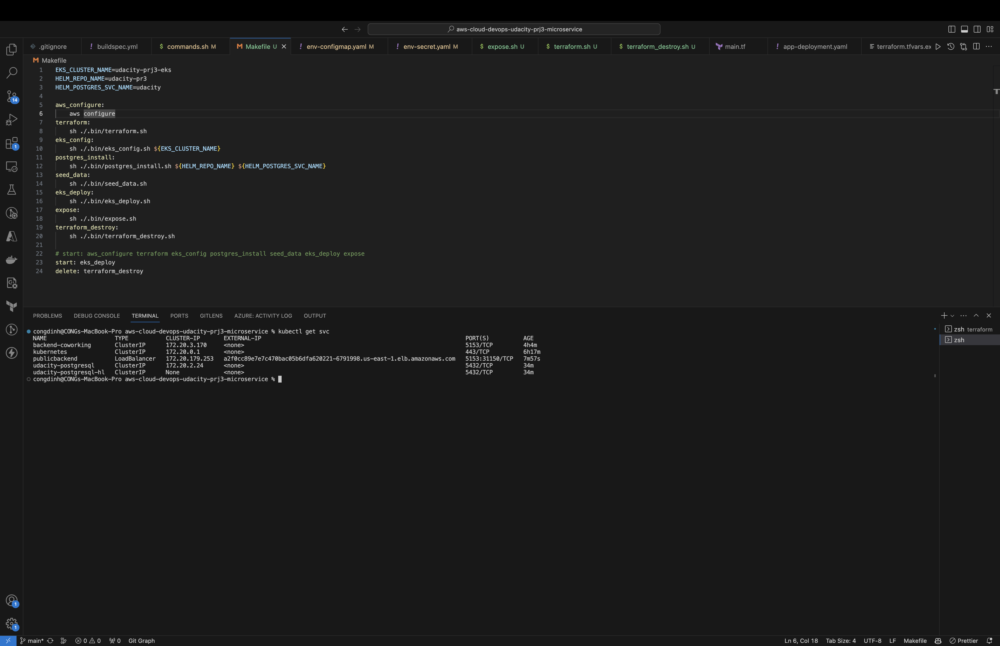
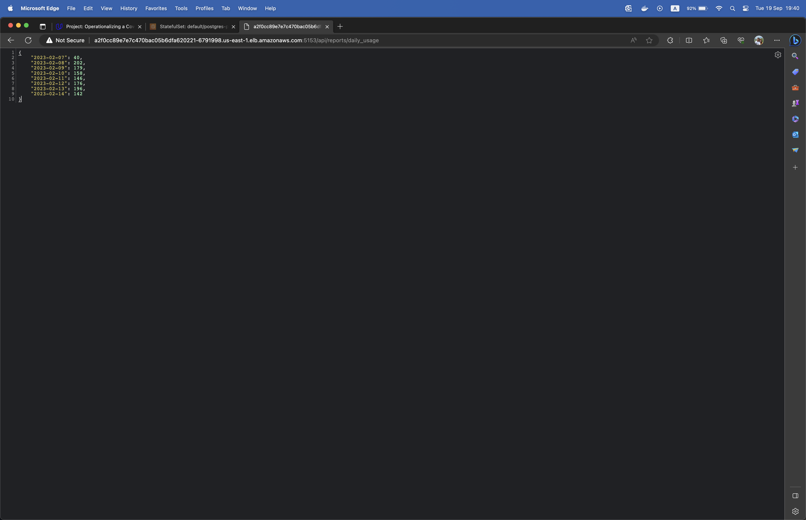
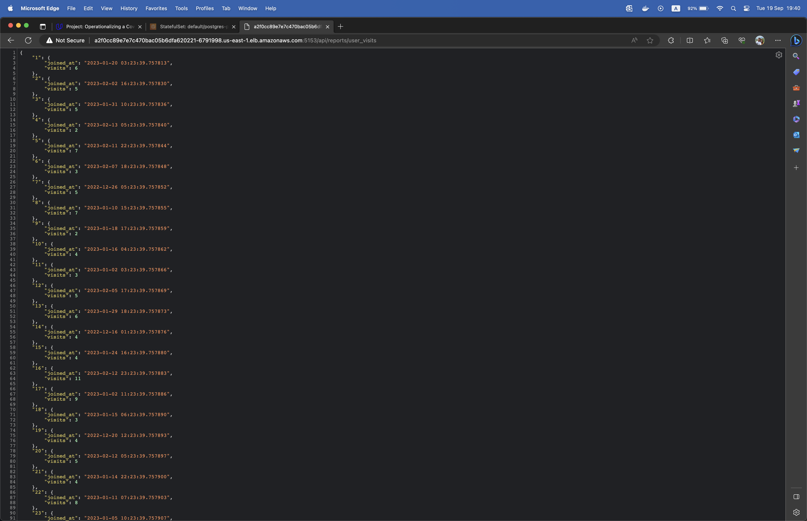
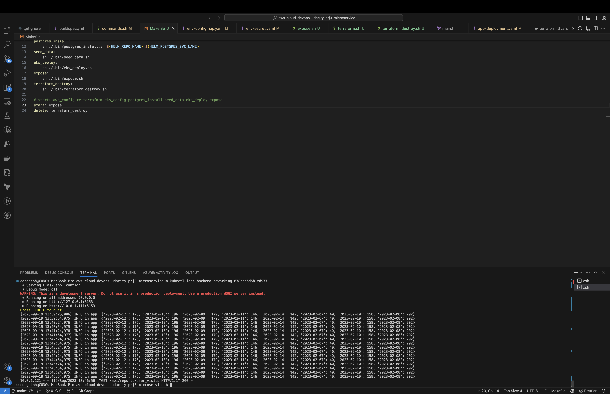
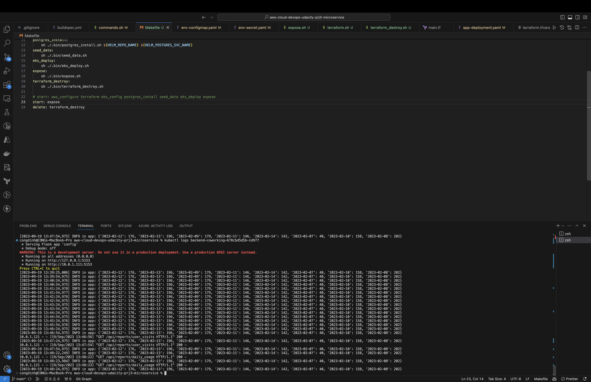

# Udacity AWS Cloud DevOps Engineer - Project 03 - Operationalizing a Coworking Space Microservice

## Project Overview

Project: Coworking Space Service
The Coworking Space Service is a set of APIs that enables users to request one-time tokens and administrators to authorize access to a coworking space.

This service follows a microservice pattern and the APIs are split into distinct services that can be deployed and managed independently of one another.

For this project, you are a DevOps engineer who will be collaborating with a team that is building an API for business analysts. The API provides business analysts with basic analytics data on user activity in the coworking space service. The application they provide you functions as expected, and you will help build a pipeline to deploy it to Kubernetes.

## Getting Started

Start by cloning the starter repository for the project.

### Project Dependencies

You'll need a workspace for this project. You can use the workspace in the classroom on the following pages, or you can complete the project using your local computer.

### Workspace Environment Requirements

You'll need these tools to compete this project. If you are using the Udacity workspace on the following pages, all of these tools are installed and provided in the workspace.

If you're using your own local computer, you'll need:

- Python Environment - run Python 3.6+ applications and install Python dependencies via pip
- Docker CLI - build and run Docker images locally
- kubectl - run commands against a Kubernetes cluster
- helm - apply Helm Charts to a Kubernetes cluster
- GitHub - pull and clone code

### Remote Resource Requirements

This project utilizes Amazon Web Services (AWS). You'll find instructions for using a temporary AWS account on the next page. The AWS resources you'll need to use for the project include:

- AWS CLI
- AWS CodeBuild - build Docker images remotely
- AWS ECR - host Docker images
- Kubernetes Environment with AWS EKS - run applications in k8s
- AWS CloudWatch - monitor activity and logs in EKS

## Project Instructions

### Dependencies

- [AWS Account](https://aws.amazon.com/)
- [AWS CLI](https://docs.aws.amazon.com/cli/latest/userguide/getting-started-install.html)
- [Terraform](https://developer.hashicorp.com/terraform/downloads?product_intent=terraform)
- [Helm Chart](https://helm.sh/docs/intro/install/)
- [PostgresSQL](https://www.postgresql.org/download/)
- [Minikube](https://github.com/kubernetes/minikube)
- [VSCode](https://code.visualstudio.com/)

### Clone the project

1. Clone Project Code

   ```
   git clone https://github.com/congdinh2008/aws-cloud-devops-udacity-prj3-microservice.git
   ```

### Project Structure

1. [.bin](https://github.com/congdinh2008/aws-cloud-devops-udacity-prj3-microservice/tree/main/.bin): Bash file to complete project
2. [db](https://github.com/congdinh2008/aws-cloud-devops-udacity-prj3-microservice/tree/main/db): Scripts to seed data
3. [deployment](https://github.com/congdinh2008/aws-cloud-devops-udacity-prj3-microservice/tree/main/deployment): Kubernetes yaml files
4. [terraform](https://github.com/congdinh2008/aws-cloud-devops-udacity-prj3-microservice/tree/main/terraform): Terraform file to create AWS resource
5. [screenshots](https://github.com/congdinh2008/aws-cloud-devops-udacity-prj3-microservice/tree/main/screenshots): Screenshots

### How to run

1. Create AWS resource with terraform
2. Config Kubect with EKS Cluster Name
3. Set up PostgreSQL with Helm Chart
4. Seed data using kubectl port-forward and psql
5. Create AWS CodePipeline to build and push image to AWS ECR
6. Create a service and deployment yaml files to deploy web api
7. Apply configmap, secret, service and deployment yaml files
8. Create an external load balancer using kubectl expose
9. Check web api
10. Check logs from CloudWatch and kubectl logs pod-name

You can use the following command to do:

```
make start
```

### CloudWatch Metrics in EKS

Kubernetes clusters created with EKS are set up to integrate with CloudWatch Container Insights by default.

This captures common sets of metrics such as CPU, memory, disk usage, and network traffic details. Additional data such as container diagnostic data is also captured.

Configuring CloudWatch Insights
CloudWatch insights are easy to configure on your cluster.

1. Node Role Policy
   Your policy for your EKS node role should include CloudWatchAgentServerPolicy for the agent to properly forward metrics.

2. Install CloudWatch Agent
   In the following command, replace `<YOUR_CLUSTER_NAME_HERE>` on line 1 with the name of your EKS cluster and replace `<YOUR_AWS_REGION_HERE>` on line 2 with your AWS region. Then, run the command on an environment that has kubectl configured.

   ```
   ClusterName=<YOUR_CLUSTER_NAME_HERE>
   RegionName=<YOUR_AWS_REGION_HERE>
   FluentBitHttpPort='2020'
   FluentBitReadFromHead='Off'
   [[ ${FluentBitReadFromHead} = 'On' ]] && FluentBitReadFromTail='Off'|| FluentBitReadFromTail='On'
   [[ -z ${FluentBitHttpPort} ]] && FluentBitHttpServer='Off' || FluentBitHttpServer='On'
   curl https://raw.githubusercontent.com/aws-samples/amazon-cloudwatch-container-insights/latest/k8s-deployment-manifest-templates/deployment-mode/daemonset/container-insights-monitoring/quickstart/cwagent-fluent-bit-quickstart.yaml | sed 's/{{cluster_name}}/'${ClusterName}'/;s/{{region_name}}/'${RegionName}'/;s/{{http_server_toggle}}/"'${FluentBitHttpServer}'"/;s/{{http_server_port}}/"'${FluentBitHttpPort}'"/;s/{{read_from_head}}/"'${FluentBitReadFromHead}'"/;s/{{read_from_tail}}/"'${FluentBitReadFromTail}'"/' | kubectl apply -f -
   ```

This will install CloudWatch insights into the namespace amazon-cloudwatch on your cluster.

After this is configured, you can navigate to CloudWatch in the AWS console to access CloudWatch Insights.

### Get Web API URL

1. Get load balancer external ip

   ```
   kubectl get svc
   ```



### Result

1. Web API





2. CloudWatch


1. Kubectl logs pod





### Delete Resource

1. Run the following command to delete all resource with terraform

   ```
   make delete
   ```
